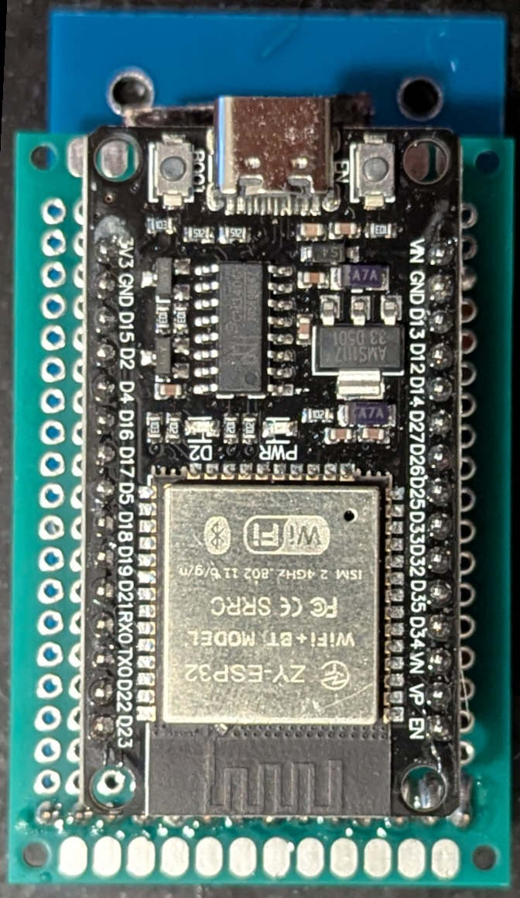
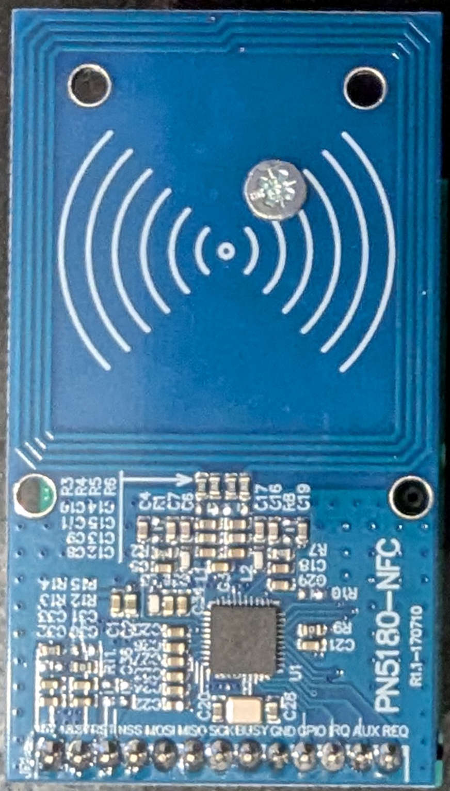
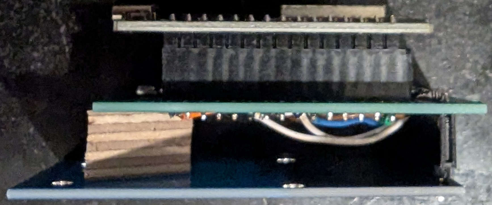

# esphome_qalcosonicnfc
ESPHome component for reading an Axioma Qalcosonic W1 water meter via a PN5180 NFC chip

## Needed components
- ESP32
- PN5180-NFC module (Can be easily obtained via AliExpress. I paid around 5 USD in August 2025.)
- Some breaboard cables
- (Perfboards)

## Wiring
| ESP32 Pin | PN5180 Pin |
| :---      | :---       |
| VIN / 5V  | 5V         |
| 3.3V      | 3.3V       |
| GND       | GND        |
| SCLK, 18  | SCLK       |
| MISO, 19  | MISO       |
| MOSI, 23  | MOSI       |
| 14        | NSS        |
| 16        | BUSY       |
| 17        | RST        |

## Special Thanks
Special thanks goes to @ATrappmann for his PN5180-Library (https://github.com/ATrappmann/PN5180-Library).
Without his work, this project would not have been possible.
Also I thank everyone who has contributed to this repository for their work.

## Example configuration
```
external_components:
  - source:
      type: git
      url: https://github.com/dbmaxpayne/esphome_qalcosonicnfc
      #ref: refs/pull/5/head # Uncomment to test an active pull request 
  #- source:
  #    type: local
  #    path: my_components
    components: [ qalcosonicnfc ]
    #refresh: 1min # Refresh interval. Leave this commented if you're not testing any new pull requests
  

esphome:
  name: qalcosonic-w1-nfc-reader
  friendly_name: Qalcosonic W1 NFC Reader

esp32:
  #board: esp32-c3-devkitm-1
  board: esp32dev
  framework:
    type: esp-idf # You can use arduino, too

button:
  - platform: template
    name: "Force Sensor Update"
    on_press:
      - component.update: qalcosonicnfc_id

qalcosonicnfc:
  id: qalcosonicnfc_id # ID used for the manual update button
  update_interval: 300s # How often should the component query the water meter for a value.
                        # Battery drain:
                        # 60s: ~ 1% per 75 days (added 10.02.2026, tested by dbmaxpayne)
  pn5180_mosi_pin: GPIO23
  pn5180_miso_pin: GPIO19
  pn5180_sck_pin:  GPIO18
  pn5180_nss_pin:  GPIO14
  pn5180_busy_pin: GPIO16
  pn5180_rst_pin:  GPIO17
  water_usage_sensor:
    # in m³
    name: "Water usage"
  water_usage_positive_sensor:
    # in m³
    name: "Water usage (only positive)"
    disabled_by_default: True
  water_usage_negative_sensor:
    # in m³
    name: "Water usage (only negative)"
    disabled_by_default: True
  water_flow_sensor:
    # in m³/h
    name: "Water flow"
  water_temperature_sensor:
    # in °C
    name: "Water temperature"
  external_temperature_sensor:
    # in °C
    # ambient temperature
    name: "External temperature"
  battery_level_sensor:
    name: "Battery level"
  timepoint_sensor:
    name: "Time point"
    timezone: "Europe/Berlin" # optional;
      # if not set, timezone will be inferred from ESPHome's timezone
      # Home Assistant requires a timezone to recognize a timestamp as a propper time and date instead of just text
      # if no timezone can be found, the time point will be emitted a plain text to Home Assistant
    disabled_by_default: True
  operating_time_sensor:
    # in seconds
    name: "Operating time"
    disabled_by_default: True
  on_time_sensor:
    # in seconds
    name: "On time"
    disabled_by_default: True
  serial_number_sensor:
    # eight digits as text
    name: "Serial number"

  # The following binary sensors are generated based on the error flags
  error_reconfiguration_warning:
    # Error digit 1, error code 1
    name: "Reconfiguration Warning"
  error_no_consumption:
    # Error digit 1, error code 2
    # Is set when there was no water usage for the last either 3/7/30 days
    # Not enabled by default
    name: "No consumption"
  error_damage_meter_housing:
    # Error digit 1, error code 4
    # This is the tamper alarm; occurs when meter is opened or damaged
    name: "Damage of meter housing"
  error_calculator_hardware_failure:
    # Error digit 1, error code 8
    name: "Calculator's hardware failure detected"
  error_leakage:
    # Error digit 2, error code 1
    # Is set, if the constant flow is either 0.25%/0.5%/1% (default 1%) of Q₃ (printed on meter) for 24 hours
    # Is unset if the flow is lower than the alarm threshold for one hour
    name: "Leakage"
  error_burst:
    # Error digit 2, error code 2
    # Is set, if the constant flow is either 5%/10%/20% (default 10%) of Q₃ (printed on meter) for one hour
    # Is unset if the flow is lower than the alarm threshold for 32 seconds
    name: "Pipe is cracked (Burst)"
  error_optical_communication:
    # Error digit 2, error code 4
    # Can also be a general communication error for meters with LoRa WAN communication type
    name: "Optical communication temporarily stopped"
  error_low_battery:
    # Error digit 2, error code 8
    name: "Low battery (less than 12 months lifetime left)"
  error_software_failure:
    # Error digit 3, error code 4
    name: "Software failure detected"
  error_hardware_failure:
    # Error digit 3, error code 8
    name: "Hardware failure detected"
  error_no_signal:
    # Error digit 4, error code 1
    # Empty pipe (pipe is not filled with water or air bubbles are detected)
    # Is set, if problem is detected for 30 seconds and is unset if the problem disappears for 30 seconds
    name: "No signal; the flow sensor is not filled with water"
  error_reverse_flow:
    # Error digit 4, error code 2
    # Is set when meter detects negative flow that is equal to 2× of starting flow
    # Is unset if reverse flow is stopped
    name: "Reverse flow"
  error_flow_rate:
    # Error digit 4, error code 4
    # Q₄ is the meter's maximal flow rate
    # Q₄ usually 1.25 times the meter's nominal flow rate (Q₃)
    # Q₃ should be printed on top of the meter
    name: "Flow rate is greater than 1.25×Q₄"
  error_freeze_alert:
    # Error digit 4, error code 8
    # Is set when water temperature is lower than either 2/3/4/5°C (default 5°C) for five minutes
    # Is unset when the temperature is higher than the alarm threshold for five minutes
    name: "Freeze alert"
  # On the meter's LCD, the codes are added as following
  #   3 - corresponds errors 2 + 1
  #   5 - corresponds errors 4 + 1
  #   7 - corresponds errors 4 + 2 + 1
  #   9 - corresponds errors 8 + 1
  #   A - corresponds errors 8 + 2
  #   B - corresponds errors 8 + 2 + 1
  #   C - corresponds errors 8 + 4
  #   D - corresponds errors 8 + 4 + 1
  #   E - corresponds errors 8 + 4 + 2
  #   F - corresponds errors 8 + 4 + 2 + 1

  error_flags_raw:
    # the four error bytes, as hex blocks seperated with space
    # correspond to the four error digits on the display
    # e.g.: "00 00 00 00"
    name: "Error flags raw"
  # This sensor allows me to maybe find more useful data in the future.
  # You should not need it and can disable it.
  raw_data_sensor:
    name: "M-BUS raw data"
    disabled_by_default: True

# Enable logging
logger:
  logs:
    # This following can be set to DEBUG to get a lot of information like the raw SPI frames being exchanged between the ESP32 and the PN5180
    qalcosonicnfc: INFO
    PN5180: INFO
    PN5180ISO15693: INFO

# Enable Home Assistant API
api:
  encryption:
    key: "As generated by Home Asisstant when creating the device"

ota:
  - platform: esphome
    password: "As generated by Home Asisstant when creating the device"

# Network / WiFi component is needed for this component to work
wifi:
  ssid: !secret wifi_ssid
  password: !secret wifi_password

  # Enable fallback hotspot (captive portal) in case wifi connection fails
  ap:
    ssid: "Qalcosonic-W1-Nfc-Reader"
    password: "ChangeMe"

captive_portal:
```

## Images
  
