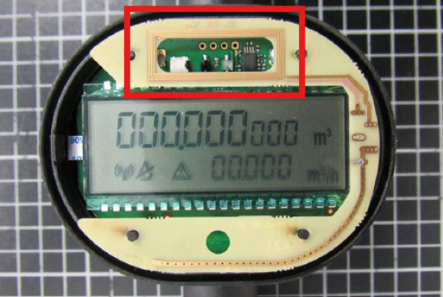

# Contribution
This is a fork of [dbmaxpayne/esphome_qalcosonicnfc ](https://github.com/dbmaxpayne/esphome_qalcosonicnfc.git).

# Changes to the original repo
Since a lot of pull requests and Issues have not been merged or looked at, I decided to create a public fork including all pull requests until 15/04/2026. Since some pull requests overlapped each other, I merged them. Feel free to create issues and pull requests. I definitely need AI to look over your features and fixes, since I am not a developer.

I adjusted the pin layout to my needs. So check your pin layout!

# esphome_qalcosonicnfc
ESPHome component for reading an Axioma Qalcosonic W1 water meter via a PN5180 NFC chip

## Needed components
- ESP32
- PN5180-NFC module (Can be easily obtained via AliExpress. I paid around 5 USD in August 2025.)
- Some breaboard cables
- (Perfboards)

## Wiring
| ESP32 Pin | PN5180 Pin |
| :---      | :---       |
| VIN / 5V  | 5V         |
| 3.3V      | 3.3V       |
| GND       | GND        |
| SCLK, 12  | SCLK       |
| MISO, 13  | MISO       |
| MOSI, 11  | MOSI       |
| 10        | NSS        |
| 14        | BUSY       |
| 21        | RST        |

## Power connection on some ESP boards
If your antenna is not getting a signal at all, check your ESP board. In my case, there was an IN/OUT solder pad on the board I had to connect together. With this, your main USB power is directly connected to your NFC board.

## Special Thanks
Special thanks goes to @ATrappmann for his PN5180-Library (https://github.com/ATrappmann/PN5180-Library).
Without his work, this project would not have been possible.
Also I thank everyone who has contributed to this repository for their work.

## Example configuration
```
external_components:
  - source:
      type: git
      url: https://github.com/PottiMc/esphome_qalcosonicnfc
    components: [ qalcosonicnfc ]
    #refresh: 1min # Refresh interval. Leave this commented if you're not testing any new pull requests

esphome:
  name: qalcosonic-w1-nfc-reader
  friendly_name: Qalcosonic W1 NFC Reader

esp32:
  board: esp32-s3-devkitc-1  # Feel free to use your board of choice
  framework:
    type: arduino # You can use esp-idf, too

button:
  - platform: template
    name: "Force Sensor Update"
    on_press:
      - component.update: qalcosonicnfc_id

qalcosonicnfc:
  id: qalcosonicnfc_id # ID used for the manual update button
  update_interval: 180s # How often should the component query the water meter for a value.
                        # Battery drain:
                        # 60s: ~ 1% per 75 days (added 10.02.2026, tested by dbmaxpayne)
  consecutive_errors_limit: 5 # Optional. Default: 5. How many consecutive failed readout
                              # attempts are allowed before sensors are set to unavailable (NAN).
                              # Set to 0 to never set sensors to unavailable.
  pn5180_mosi_pin: GPIO11
  pn5180_miso_pin: GPIO13
  pn5180_sck_pin:  GPIO12
  pn5180_nss_pin:  GPIO10
  pn5180_busy_pin: GPIO14
  pn5180_rst_pin:  GPIO21
  water_usage_sensor:
    # in m³
    name: "Water usage"
  water_usage_positive_sensor:
    # in m³
    name: "Water usage (only positive)"
  water_usage_negative_sensor:
    # in m³
    name: "Water usage (only negative)"
  water_flow_sensor:
    # in m³/h
    name: "Water flow"
  water_temperature_sensor:
    # in °C
    name: "Water temperature"
  external_temperature_sensor:
    # in °C
    # ambient temperature
    name: "External temperature"
  battery_level_sensor:
    name: "Battery level"
  timepoint_sensor:
    name: "Time point"
    timezone: "Europe/Berlin" # optional;
      # if not set, timezone will be inferred from ESPHome's timezone
      # Home Assistant requires a timezone to recognize a timestamp as a propper time and date instead of just text
      # if no timezone can be found, the time point will be emitted a plain text to Home Assistant
  timepoint_sensor_raw:
    # shows the time received by the meter as a string without any conversions
    # format is YYYY-MM-DD HH:MM
    # it can be offset by one hour because the meter does not switch to/from DST
    name: "Time point (raw)"
  operating_time_sensor:
    # in seconds
    name: "Operating time"
  on_time_sensor:
    # in seconds
    name: "On time"

  # Meter ID is derived from the M-Bus header and used to identify the meter during bus communication
  # Serial number is a separate data field, that may not always be present, and is used for billing purposes
  # When both are available, they are usually the same
  meter_id_sensor:
    # eight digits as text
    name: "Meter ID"
  serial_number_sensor:
    # eight digits as text
    name: "Serial number"

  manufacturer_id_sensor:
    # three letter manufacturer code
    name: "Manufacturer ID"
  meter_version_sensor:
    # version or revision of the meter
    name: "Meter version"

  # The following binary sensors are generated based on the error flags
  error_reconfiguration_warning:
    # Error digit 1, error code 1
    name: "Reconfiguration Warning"
  error_no_consumption:
    # Error digit 1, error code 2
    # Is set when there was no water usage for the last either 3/7/30 days
    name: "No consumption"
  error_damage_meter_housing:
    # Error digit 1, error code 4
    # This is the tamper alarm; occurs when meter is opened or damaged
    name: "Damage of meter housing"
  error_calculator_hardware_failure:
    # Error digit 1, error code 8
    name: "Calculator's hardware failure detected"
  error_leakage:
    # Error digit 2, error code 1
    # Is set, if the constant flow is either 0.25%/0.5%/1% (default 1%) of Q₃ (printed on meter) for 24 hours
    # Is unset if the flow is lower than the alarm threshold for one hour
    name: "Leakage"
  error_burst:
    # Error digit 2, error code 2
    # Is set, if the constant flow is either 5%/10%/20% (default 10%) of Q₃ (printed on meter) for one hour
    # Is unset if the flow is lower than the alarm threshold for 32 seconds
    name: "Pipe is cracked (Burst)"
  error_optical_communication:
    # Error digit 2, error code 4
    # Can also be a general communication error for meters with LoRa WAN communication type
    name: "Optical communication temporarily stopped"
  error_low_battery:
    # Error digit 2, error code 8
    name: "Low battery (less than 12 months lifetime left)"
  error_software_failure:
    # Error digit 3, error code 4
    name: "Software failure detected"
  error_hardware_failure:
    # Error digit 3, error code 8
    name: "Hardware failure detected"
  error_no_signal:
    # Error digit 4, error code 1
    # Empty pipe (pipe is not filled with water or air bubbles are detected)
    # Is set, if problem is detected for 30 seconds and is unset if the problem disappears for 30 seconds
    name: "No signal; the flow sensor is not filled with water"
  error_reverse_flow:
    # Error digit 4, error code 2
    # Is set when meter detects negative flow that is equal to 2× of starting flow
    # Is unset if reverse flow is stopped
    name: "Reverse flow"
  error_flow_rate:
    # Error digit 4, error code 4
    # Q₄ is the meter's maximal flow rate
    # Q₄ usually 1.25 times the meter's nominal flow rate (Q₃)
    # Q₃ should be printed on top of the meter
    name: "Flow rate is greater than 1.25×Q₄"
  error_freeze_alert:
    # Error digit 4, error code 8
    # Is set when water temperature is lower than either 2/3/4/5°C (default 5°C) for five minutes
    # Is unset when the temperature is higher than the alarm threshold for five minutes
    name: "Freeze alert"
  # On the meter's LCD, the codes are added as following
  #   3 - corresponds errors 2 + 1
  #   5 - corresponds errors 4 + 1
  #   7 - corresponds errors 4 + 2 + 1
  #   9 - corresponds errors 8 + 1
  #   A - corresponds errors 8 + 2
  #   B - corresponds errors 8 + 2 + 1
  #   C - corresponds errors 8 + 4
  #   D - corresponds errors 8 + 4 + 1
  #   E - corresponds errors 8 + 4 + 2
  #   F - corresponds errors 8 + 4 + 2 + 1

  error_flags_raw:
    # the four error bytes, as hex blocks seperated with space
    # correspond to the four error digits on the display
    # e.g.: "00 00 00 00"
    name: "Error flags raw"
    disabled_by_default: True

  # Sensor that indicates how many consecutive readout attempts have failed.
  # It will be 0 on a successful readout and increment on each failure.
  # Note: This value can exceed the consecutive_errors_limit, as the limit
  # only defines when the main sensors are set to unavailable (NAN).
  consecutive_errors_sensor:
    name: "Consecutive Errors"

  # This sensor allows me to maybe find more useful data in the future.
  # You should not need it and can disable it.
  raw_data_sensor:
    name: "M-BUS raw data"
    disabled_by_default: True

# Enable logging
logger:
  logs:
    # This following can be set to DEBUG to get a lot of information like the raw SPI frames being exchanged between the ESP32 and the PN5180
    qalcosonicnfc: INFO
    PN5180: INFO
    PN5180ISO15693: INFO

# Enable Home Assistant API
api:
  encryption:
    key: !secret api_key

ota:
  - platform: esphome
    password: !secret ota_password

# Network / WiFi component is needed for this component to work
wifi:
  ssid: !secret wifi_ssid
  password: !secret wifi_password

  # Enable fallback hotspot (captive portal) in case wifi connection fails
  ap:
    ssid: "Qalcosonic-W1-NFC-Reader"
    password: !secret fallback_password

captive_portal:
```

## Sensor Update Behavior (`force_update`)

By default, ESPHome numeric sensors only push an update to Home Assistant **when the value changes**. This means if your
water usage stays the same between two readout cycles, Home Assistant will not receive a new data point — which can make 
it look like the sensor is stale or not working.

To force a sensor to publish its value on **every readout cycle**, regardless of whether it changed, add `force_update: true` 
to the sensor:

```yaml
qalcosonicnfc:
  water_usage_sensor:
    name: "Water Usage"
    force_update: true
  water_flow_sensor:
    name: "Water Flow"
    force_update: true
  # ... and so on for any other sensor
```

This is especially useful for confirming the device is still alive and actively reading the meter.

> **Note:** `force_update: true` applies to numeric `sensor` types only. It does **not** apply to `text_sensor` types (e.g. `timepoint_sensor`, `raw_data_sensor`).

# NFC Antenna
Thanks to [@sstadlberger ](https://github.com/sstadlberger)! He was able to find an FCC document showing the exact positon of the NFC antenna. 



Original document: https://device.report/m/a096f06eda0d81b7ace0d57c447394fcbea40432b4325c1f500caaf8407e5b0f
Saved document: [media/axioma_q1_fcc.pdf](https://github.com/PottiMc/esphome_qalcosonicnfc/blob/908d4b05286beda7aa28f44370e2f065a9d310a2/media/axioma_q1_fcc.pdf)

# 3D Print for the water meter

It clips onto the meter and positions the PN5180 antenna correctly for reliable readouts. The NFC module and ESP32 are held in place with hot glue — I intentionally avoided screws near the antenna to keep things simple and not risk interference. The design isn't perfect, but it's been working reliably for me.

You can find it on Thingiverse: https://www.thingiverse.com/thing:7331650

## Images
  
